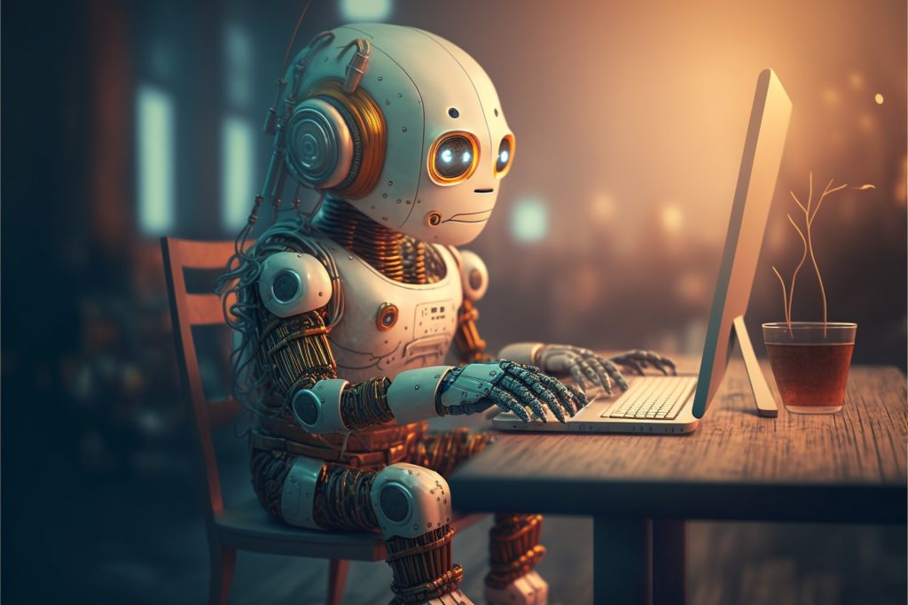

 

## Introduction

Artificial intelligence and software engineering collorate together because it allows developers to build an efficient user-centric applications. It is a branch of computer science that is concerned with building smart machines capable of performing tasks that typically require human intelligence. It is a tool that can be used to help developers create a more user friendly experience. AI tools that I have used are ChatGPT and Co-Pilot. In my eyes these tools make my life easier by giving accurate suggestions and is constantly helping me learn from my mistakes. I personally like to use Co-Pilot more. I installed Co-Pilot in my IntelliJ and from my experience it saves me a lot of time because it has pattern recognition which can predit code snippets. It makes the job not so repetitive but more manageable. 

## Personal Experience with AI

**Experience WODs:** The first time being introduced to WOD's it made me very anxious because it was either you get all the points or none at all. In my opinion my experience taking WODs is a great way to see what are your strengths and weaknesses while also being on a time crunch. The goal of the WOD is to help asses whether or not I have mastered the material from what was taught the previous week and will determine if there needs to be imporvements in my study habits. I have used AI at most times when I get stuck on a something I cant solve for more than 5 minutes.

**In-class Practice WODs:** In-class practice WODs were a great way for students to work together and get additional practice witht eh skills presented for that specific weeks module. I found in-class practice WODs to be beneficial because it gave me the opportunity to not only work with other people but whats it like to work with a group and how our ideas flow in sync. Having multiple minds and having different approaches is better than one. There was no need to use AI tools because having a partner or group helped me overcome a challenge.

**In-class WODs:** As I stated previously, WODs really pressure students to work hard to quite master the material very well for the week. For in-class WODs, I did used AI espically ChatGPT for some of them when I get stuck for more than 5 minutes because when the timer starts, time is precious. I have to be quick and efficient.

**Essays:** When it comes to writing an essay, I don't use AI because essays are meant for minds to be expressive and using thoughts of your own than using artificial intelligence in writing your essay for you. It seems a little too unauthentic and is also not a great way to express our experience and what we've learned.

**Final project:** When we've went through the whole module and finally working on our final project. I rarely use AI because of my experience with WODs. Due to the pressure WODs have gave me, it helped me gain the knowledge I needed to build a website from the ground up. When use AI, its usually when I nor my teammates dont know how to solve a certain problem.

**Learning a concept / tutorial:** I didn’t have to use AI when learning a concept or tutorial. There were intructors and teacher assistants who were always there when students don't understand a concept and needs to be futher elucidated. The materials provided were also there where I can refer back to that is include in the modules.

**Answering a question in class or in Discord:** I did not utilize AI tools to answer a question in class or on Discord when the question is understood and I know the answer to it. I make sure I answer to the best of my ability and if I don't know the answer, I would suggest them to ask the professor or ask a classmate near by and relay the answer back to them. It never really crossed my mind to use AI to answer a question.

**Asking or answering a smart-question:** I wrote an essay called ["Am I Asking The Right Questions?"](https://juvyannl.github.io/essays/smart-questions.html) which is basically about how to ask a perfect smart-question and not a dumb question. When asking a smart-question, it must be deeply researched first and if not found on the internet, introduce the problem before posting the whole ENTIRE code.  Personally, I haven't been asking smart-questions because usually other student has already addressed the problem on Discord with the same issue along with how they solved it. Overall, I don't use AI to ask or answer a smart-question because I don't think it's necessary and keep in mind to do these guidelines from [stackoverflow.com](https://stackoverflow.com/help/how-to-ask) that can help you ask a good question.

**Coding example:** I think that its highly efficient to use AI for a coding example. When I got first introduced to Underscore, it was really hard for me to understand and get the syntax and functions down. I utilized ChatGPT to give an example of using _.map or _.pluck. It was very helpful because it gave me a better understanding of how to use it and what it does. Utilizing the actually [Underscorejs.org documentation](http://underscorejs.org) as well was very helpful at providing coding examples. But I think that AI is a great tool to use when you're stuck and need a quick solution instead of finding it on a documentation.

**Explaining code:** This is one of this strong area of AI, since it’s explanation is adjustable base on your needs and provides a lot of personable examples instead of hard text explanation. I find myself using AI a lot to explain certain use of Code and it often net a positive result.

**Writing code:** I do use AI tools here and there when writing code as I mentioned before when I get stuck on a problem. For example, I ask ChatGPT, “How can I change my navbar color from white to blue.” It would reply back with the most accurate solution with a skeleton page. 

**Documenting code:** Documenting code is very important for software engineers to get use to. Such as commenting, it will make the code more cleaner and easier to understand or find a error. I dont find AI tools helpful when explaining and suggested comments on my code. But on the other hand, I would use AI to help me with the syntax of the documentation.

**Quality assurance:** Quality assurance was one thing I struggled with a lot. When I would recieve error messages I would ask ChatGPT what wenet wrong in my code and it would provide a step by step solution to the error. Sometimes this would work, but other times it was not helpful at all. When ChatGPT's solution would still spit out an error, I would turn to my professor or classmates for help asking a smart-question.

**Other uses in ICS 314:** ICS 314 is a great class to utilize and get use to AI. I think that AI is a great tool to use when you're stuck and need a fast solution. Althought not all of AI's answers are correct but it has helped me overcome multiple obstacles, from coding assignments and error troubleshooting.

## Impact on Learning and Understanding

AI has definitely influenced my learning experience as it has impacted me on my knowledge, skill development, and problem solving skills. I've learned many things from AI from whenever I would get stuck on a problem. It definitely taught me to overcome my mistakes and learn from them. I noticed that AI tend to give better and informative solutions when asked a smart question but when asked a dumb question by the user, sometimes it wouldn't understand or would give a short answer to what it thinks you're trying to ask. Its great to think of AI as not a bad way such as cheating but is used between using AI as a tool to enhance learning and stop it from taking away the place of critical thinking and creativity.

## Practical Applications

AI is very useful in the real world outside of ICS 314. One of the main points of AI is that it can speed up production of certain things. Software engineers and game designers won’t need to spend as much time coding as they could be testing new, exciting things rather than fixing basic bugs.

## Challenges and Opportunities
A challenge I have encountered while using AI is whether I am using it compromising my learning experience. It is really easy to just copy and paste my homework assignments into ChatGPT and have it do it for you.

## Comparative Analysis

Traditional teaching methods and AI options have many strengths and weaknesses. One of AI’s advantages in the development of practical skills is that it can give immediate feedback on coding techniques, which speeds up the software engineering learning curve. However, AI is not perfect and can sometimes give incorrect answers. This can be a problem for students who are not familiar with the subject matter and are unable to tell if the answer is correct or not. Traditional teaching methods are more reliable in this regard, as they are able to provide feedback on the student’s work and help them improve their skills.

## Future Considerations

I for sure know that AI will eventually get better at learning specific details of people, and personalizing answers better to everyone individually. In software engineering, I believe that eventually AI would be able to work side by side with developers in making coding easier to develop.

## Conclusion

AI is a great tool to use for programmers, and non-programmers. Through the use of ChatGPT, I could be able to find solutions to specific errors and problems in my code faster, as well as get general ideas on how to do things.
