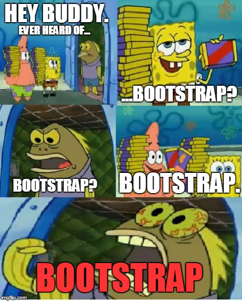

 

## Introduction to UI frameworks
What is a UI framework? It is a collection of pre-built components, libraries, and design elements. It is used to create the skeleton of a website and help developers build a website faster and easier. It is a collection of HTML, CSS, and JavaScript. There are a bunch of UI frameworks out there including Bootstrap, React, Angular, and many more. I've recently learned how to use Bootstrap and learned that it is one of the most popular UI frameworks out there. It is a free and open-source CSS framework directed at responsive, mobile-first front-end web development. It contains cascading style sheets that is used to control the appereance of a documnet written in HTML and can specficy a wide range of visual styles that includes the font, colors, margins, and more.

## The real purpose why we have to use UI frameworks

User interfaces play an important role in any web application. They are used by front-end developers to create the look and appereance of a  website. It is a backend-developers best friends. When using UI frameworks like bootstrap for example designers can write in thei HTML code with the relevant CSS classes and try to make the website interactive with the user. There are many benefits of using frameworks such as:
- <strong>It saves time and more efficient</strong>
  - It make development faster. There is a wide rangle of ready-to-use components, and elements. A website that has been really helpful to me was the [Bootstrap documentation](https://getbootstrap.com/docs/5.0/getting-started/introduction/). It has a bunch of examples and templates that you can use to help you get started. It is very beginner friendly and easy to use.
- <strong>It is responsive:</strong>
  - It ensures the website looks good when rendered on different screen sizes like on mobile devices and tablets.
- <strong>It is consistent:</strong> 
  - It follows the same structure and format throughout the whole program while creating cleaner, more efficient code for the best user experience.
- <strong>It is mobile/cross-browser friendly</strong>
  - There are various brosers like Chrome, Safari, Firefox and Internet Explorer. It will make sure that the web application works smoothly on all browsers.

## Conclusion
I am a sucker for beautiful UI designs and obsessed with trying out all kinds of CSS framworks. A website I like to look at for web design inspiration is [www.awwwards.com](https://www.awwwards.com). It recognizes the creativity and talent that developers are capable of. People canbe able to sumbit their work on the website for the whole world to see and can get special awards while gaining recognition. Although it took me sometime to learn the basics of Bootstrap and how to use it, I find it very fun because it allows the the developer to become very creative. The many benefits that I've listed above are just a few things why many people prefer to use UI frameworks than just raw HTML and CSS. It makes developers life much easier. I am excited to learn more about UI frameworks and how to use them to create beautiful websites.