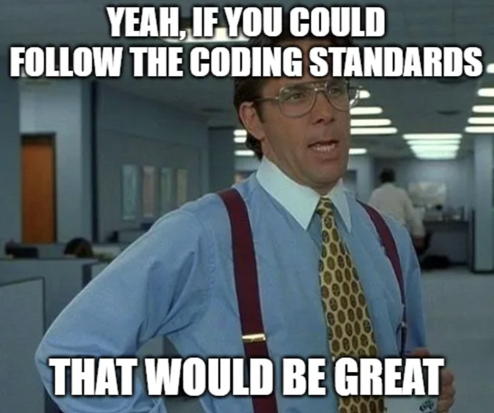

 

## My Realization of the Beauty of Code Standards
We all know the pain of having errors, bugs, and inconsistencies in JavaScript. After using the tool ESLint with IntelliJ, it made my life  simplier and saved me a ton of time. For those who dont know that ESLint is, its a static code analysis tool that checks JavaScript code for common problems such as errors, indentation issues, and many more with Node.js installed. I've learned that code standards are important because it makes it easier for other programmers to read and understand your code. It gives an appealing and uniform apperance to the code. By using ESLint, it ensures that the code is consistent and that it follows the same structure and format throughout the whole program while creating cleaner, more efficient code

## Happiness of Green Check Marks
By using ESLint, I find the green check mark very useful because it shows that nothing went wrong in the code. It also makes me feel accomplished and relieved in the inside which every coder wants to feel. ESLint is nitorious for detecting errors and giving great suggestions on how fix it. When ESLint throws you an error and you dont know how to fix it, it automatically gives you a suggestion. It's like a spell check for code. It's very beginner friendly and easy to use if you have no idea what to do next. Taking advantage of this tool will help you become a better programmer and will help you learn from your mistakes. 

## Conclusion

If I were to read code that had messy indentation, I would have been very confused on where the statement ends and would not want to read it. Code should be easily understandable and readable.