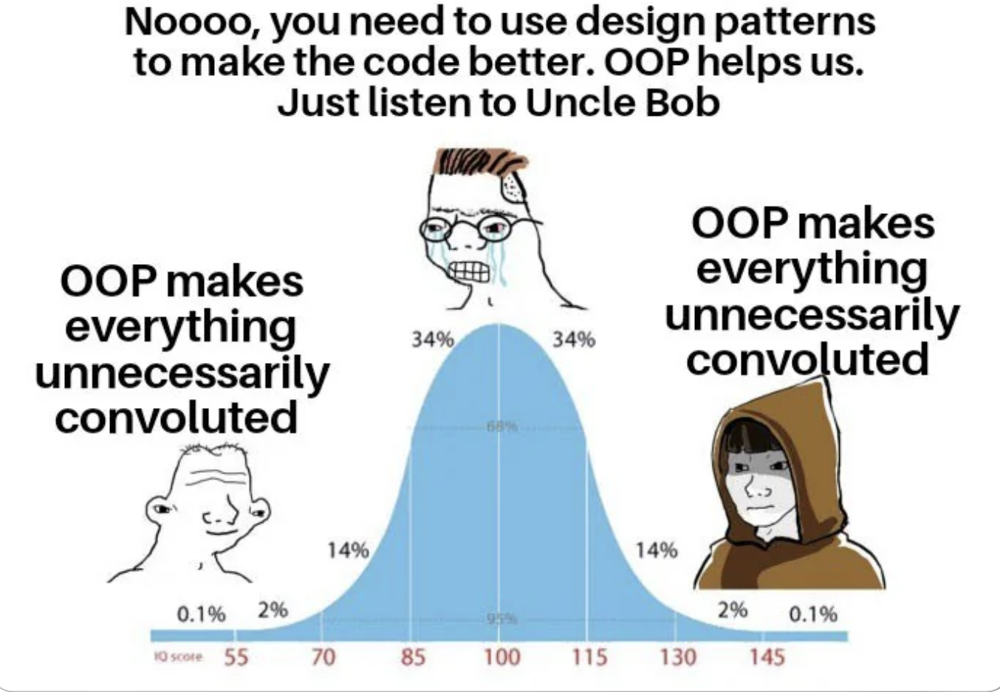

 

Design patterns are a reuseable solution to a commonly occurring problem in software design. It is a description or template for how to solve a problem that can be used in many different situations in a way to be efficient. It is a way to communicate with other programmers and to help them understand the code. 

After well researching the different types of design patterns, I've learned that there are many different types of design patterns that can be used in different situations such as:

- **Creational patterns** mainly focus on object creation mechanisms that increase flexibility and reuse of existing code. 

- **Singleton pattern** is a creational pattern that ensures that a class has only one instance and provides a global point of access to it.

- **Structural patterns** are about organizing different classes and objects to form larger structures to provide functionality and efficiency.

- **Behavioral patterns** are about identifying common communication patterns between objects and defining the patterns.

The types of design patterns I have used in my own code is structural pattern because I like to keep everything organized in a way where I can spot the errors and fix anything that looks out of place. I like to keep my code clean and simple while it also enhances code readability and maintainability. I've used the structural pattern in my ICS 211 class when we had to create a fishing game. We had to split the work into different fish families which were Oama, Ohua, Moili'i, and Pua_ama (mullet family). It was much easier to finish the work faster. I was use ESLint to check the formatting of my code to make sure that it was consistent and that it followed the same structure and format throughout the whole program. ESLint is a static code analysis tool that checks JavaScript code for common problems such as errors, indentation issues, and many more with Node.js installed. It is a software tool that I've religiously used in my ICS 314 class. It gives an appealing and uniform apperance to the code which is extremely crucial when it comes to coding. 

## Conclusion
My knowledge on design patterns are very limited and on the beginner level but I am eager to learn more about it. I believe that it is a very important concept to learn because it will help me become a better programmer. I'm glad that I was introduced to this concept because I believe it will help me in the long run when I apply for tech jobs.