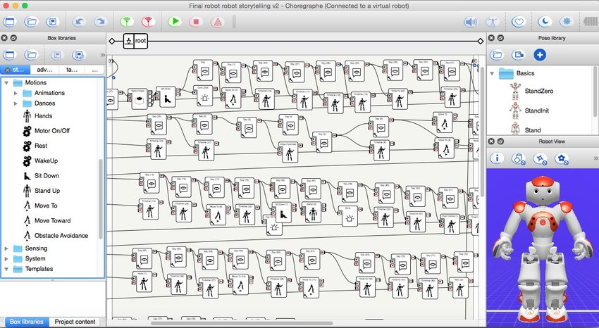

## Introduction
A little background about NAO, it is the first humanoid robot created by Aldebaran Robotics in 2005. The robot has built-in sensors to help closely mimic human behavior. It has become recognized as the standard robotized for education and research purposes. To interact with the robot, I utilized Choreograph which is a multi-platform desktop application that allows users to create animations, behaviors, and dialog. It is pretty cool how it works, you could drag and drop items with code built within the icons. After dragging and dropping the actions you want, you simply connect those actions to form your program, creating a flow diagram. Choregraphe is the core element to relay how to monitor and control the robot. 

## My Experience
The main purpose was to explore the possibilities of what an AI can do and gain experience with machine learning. I attempted to program robot to focus on simple movements and conversation using box libraries such as teaching NAO how to dance, sing, teach others how to play golf, ask your favorite color, etc. I've dealt with challenges including speech recognition, internet connectivity issues, and facial recognition. The most difficult part for me to crack was the voice recognition, it seems like there was a potential bias toward male voices and less on people who had accents. Sometimes you either speak slower, change the intonation of your words, or speak faster.

NAO does not have a brain; it is not aware of what potential answers like “blue” or “red” even are, let alone what “colors” even are. I would have to program proper responses for those words. Also, those are only two colors. What if the person responds with something like “purple” or “cyan?” That is where things get very little tricky. Asking closed-ended questions with a limited set of possible answers is a solution towards the issue. Something like “Do you like blue or red more?” could work. We could also make NAO have a general response like “That is a nice color!” that it can say upon detecting any noise. Nevertheless, both those solutions also come with their problems. There are many such issues like that in robotics. Everything in robotics is done and achieved by trial and error.

## Conclusion
Overall, programming a robot from scratch is challenging. Everything that is done and achieved is by trial and error. Everything that the robot knows and how it interacts must be coded in. It was found for it easier to ask non open ended questions for a much less chance of error. Working with NAO gave me a glimpse of the many problems that come with working with robots and ways to solve them.  

