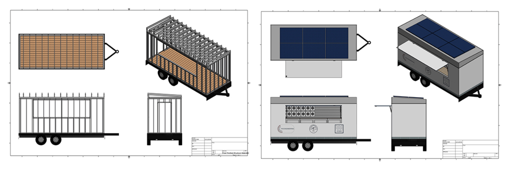

Learn more about the [WSL trailer](https://www.hsta.org/news/recent-stories/teacher-leads-farrington-students-to-complete-surfing-trailer-project/).

The World Surf League honorably chose Farrington High School to design and build a new improved trailer that meets their needs. The goal is to construct a durable and self-sustaining trailer for the customers and the clients to enjoy. 

This project took a whole year to complete. The engineering academy brainstormed design plans and model-sized versions of what the trailer would look like. We utilized AutoCad to remodel and create individual concepts on their old trailer with a creative idea of a new trailer for them. These technical drawings on the software will portray what the future merchandise trailer will appear. When completed, the drawings are transferred to a more rigorous program AutoDesk Inventor. We designed actual 3D and realistic drawings on Inventor. We did extensive research to make the trailer durable, eco-friendly, modern of high quality but also to their liking of an aerodynamic design, that has more storage capacity with less weight and have a better interior airflow.

Overall, it takes a lot of time, skill, knowledge and devotion to design and build a trailer from the bottom to the top. The trailer that was built has natural ventilation and sunlight while also giving out a style of a Hawaiian vibe to the public's eye. The new, sustainable trailer will have a TV mount, display case, shade, and many more features for the customers. We wanted the trailer to be built with functionality and creativity to improve the customers experience. I am glad to be a part of this hands-on project and get a little taste of a real world job experience. The WSL trailer is now on the road selling T-shirts, stickers, and other merchandises at surf meets. 

