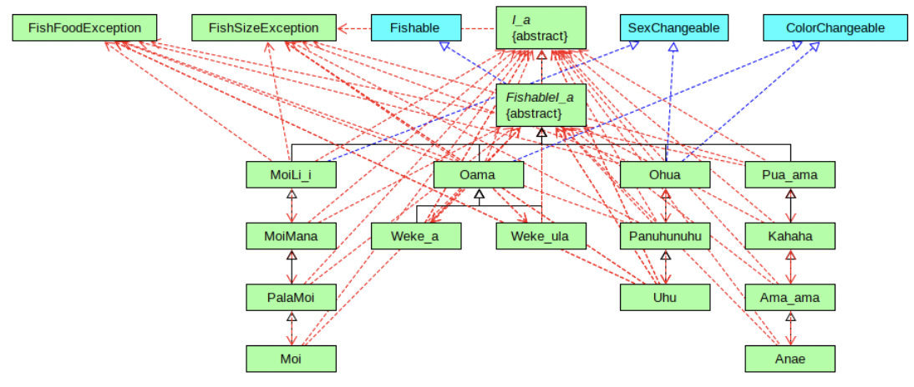
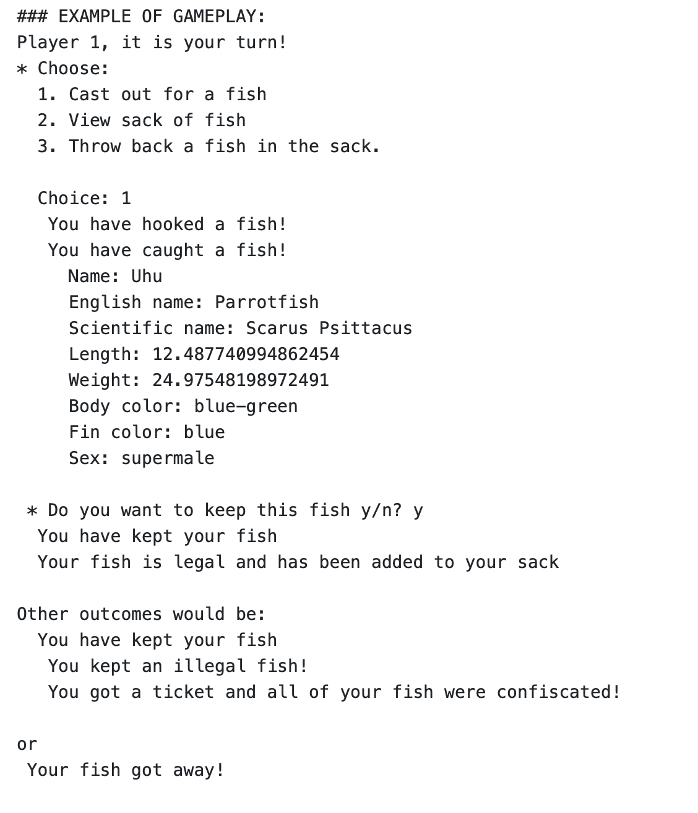

  

This game is a two player fishing tournament game using I_a object classes. Two players will alternate turns on the same computer. The players will catch fish and put them into a "sack" (an ArrayList, sorted in descending order by length)
After 12 turns each, the player with the three largest fish is the winner.

For this project, we split the work into different fish families which were Oama, Ohua, Moili'i, and Pua_ama (mullet family). I was responsible for programming the Pua-ama and Ohua family and making sure they have a legal size, if its bait, if the season is open, etc. 

There were three phrases to the tournament:

### Loko i'a(Fish Pod) Setup - Phrase 1
The first thing that should happen in the Fishing Tournament is the Fish Pond (ArrayList) that should fill up with baby fish of all Fishable types, then it should loop for around 2 pretend years (24 months) so the fish can grow to be roughly legal size.

### Lawa i'a(Fishing) - Phase 2
This phase is the main part of the game, the fishing tournament should last for a whole "year" (12 months). With two players, each player's turn, the "month" will be over and change to the next "month". When the "month" changes, the fish in the pond should eat and grow once. During each player's turn, they will get to attempt to catch a fish three times. Each attempt will have three possible outcomes: No fish is hooked (random empty ArrayList location hit) or a fish is hooked (fish randomly picked from ArrayList pond) and is either caught or gets away. If the fish is caught, the player will then need to decide whether or not to keep it. If the fish is kept, the fish should be checked for legal size and legal month. If the kept fish is legal, it should be added to the player's sack and removed from the pond. If the kept fish is not legal, the player will be punished by having all of their fish confiscated (sack of fish emptied)
This project demonstrates technical implementation while also working with others using Java. 

  

### Game Over - Phase 3
Once 12 "months" of turns have been taken, the two players' lists should be compared. The player with the largest three fish (sum of the three longest lengths) is the winner! 

This project demonstrates technical implementation while also working with others using Java. 
