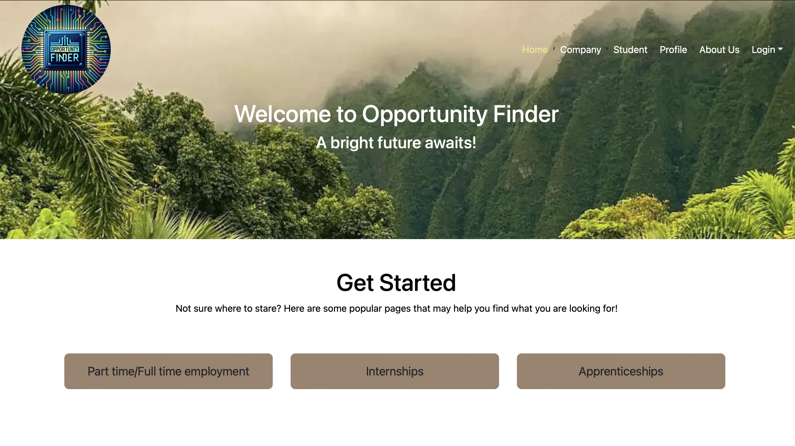

## Overview

Opportunity Finder is a web application that helps students find opportunities to gain experience and companies to find the perfect candidate for the job. This project was created for my ICS 314 Software Engineering class. The goal of this project is to create a web application that allows students to find opportunities to gain experience and companies to find the perfect candidate for the job. This project was created using IntelliJ, Javascript, HTML, Meteor, and GitHub.

The problem: Many UH computer science and engineering students want to learn about internship and job opportunities, but currently they must wait until a company decides to visit the campus or send out some sort of announcement. There is no efficient way for students to understand the “landscape” of internship and job opportunities that might be available in the future, so they can prepare for them now.

The solution: The Company Connector web application provides a new way for local and non-local companies who want to recruit students from UH to make their (potential) opportunities known to students. At the same time, students can create profiles on the site with their interests. The site can match students to employers and vice-versa.

## Contributions
Me along with 3 other team members had 4 weeks to create a web application that would make a positive impact to the community. We split the 4 week project into 3 milestones where each student is assigned to two issues that are needed to be fixed in that week. 

My contributions to this project include creating the add profile page, the edit profile page, log in, sign up, and footer. The first milestone I was in charge of the log in/sign up application where either students or companies can register or log in. The second and third milestone I was in charge on the student page, footer, and the company(add). Students who visit the site can create a profile with their interests (skills), preferred geographic location, link to their professional portfolio page, and many more. I also helped with the design of the home page and the profile page along with testing the application/documentation of this project. The screenshots below is an example page I created for this project.

## My experience

Working on this project was a really great experience to have while working with other people, it mimics what a real-life project collaboration would be like. I learned what it was like to work with a team and how to communicate with other team members when putting all of my software engineering skills to use. I gained more experience on how to use GitHub and how to use it to collaborate with other team members. I would say it was quite difficult because of the time crunch we had. We built this website from scatch for my ICS 314 in college and I will continue to work on this project to make it better.

